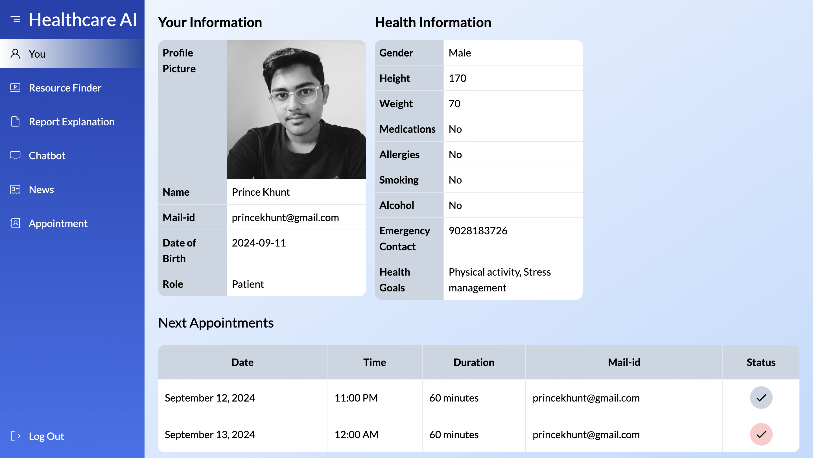
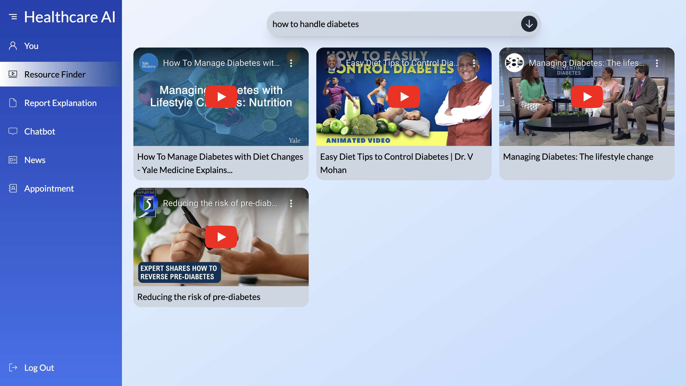
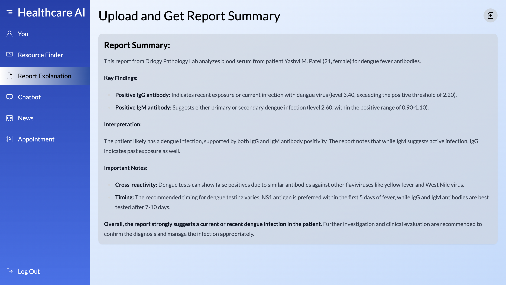
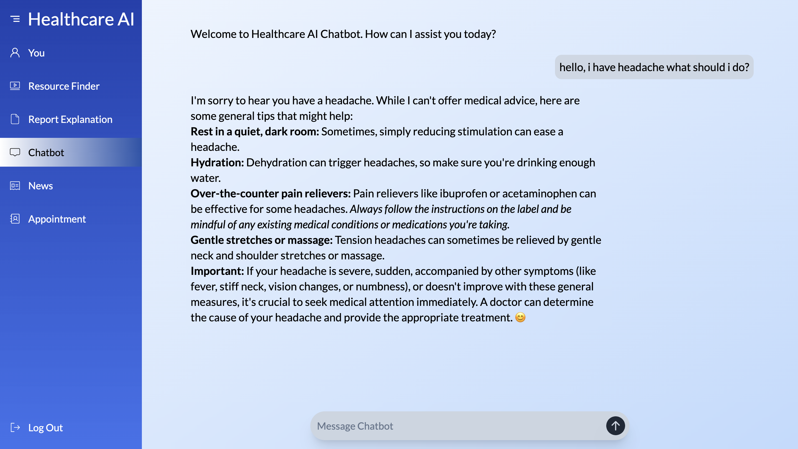
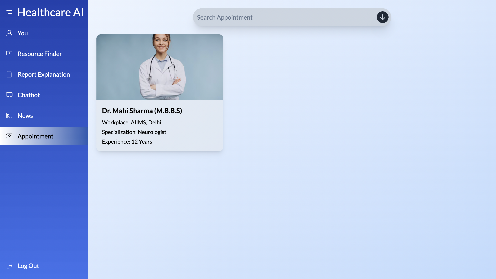
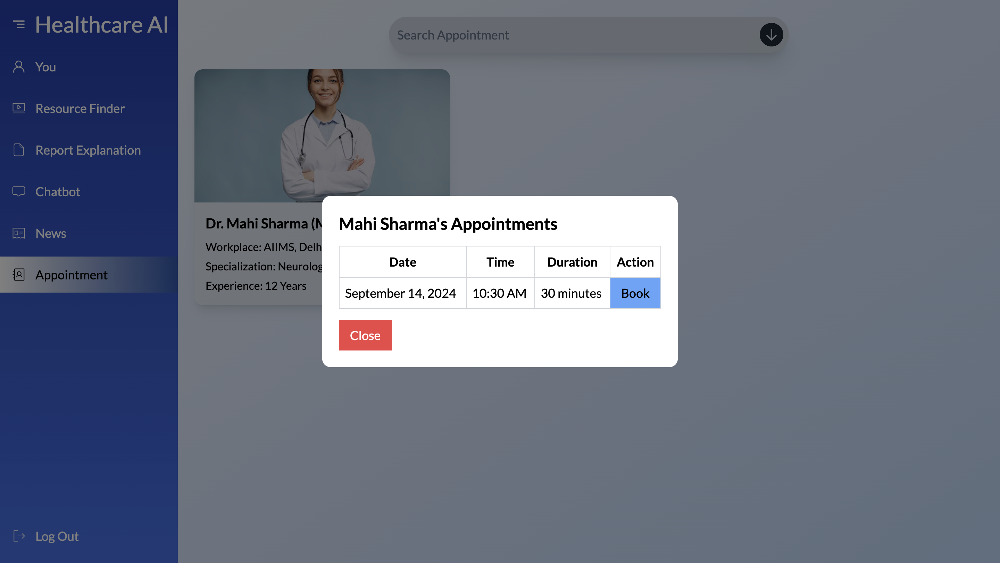
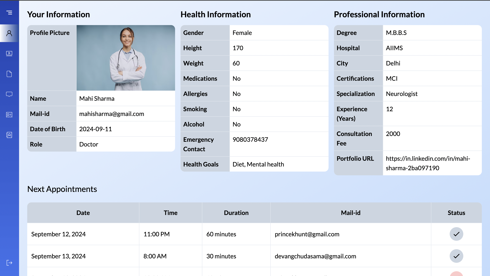
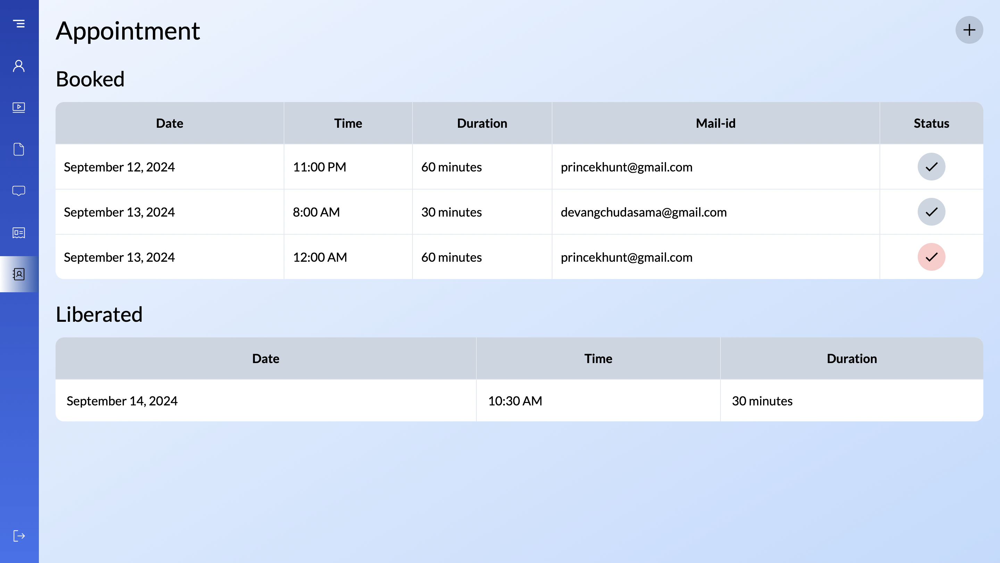
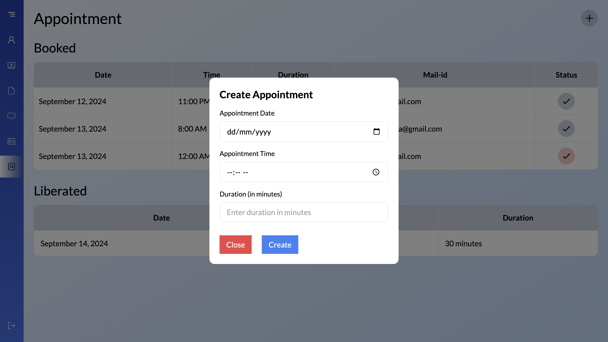

# **HealthcareAI: Langchain-FAISS-Database-Ollama-Grok-React.js-Flask**

## **Previews**

---

This project was developed during the **Hack the Mountain Hackathon**, combining AI-powered features and modern web technologies to create a comprehensive healthcare platform.

### About the Project

This application bridges the gap between patients and doctors by offering features like medical report explanation, chatbot support, appointment management, and more, all built from scratch as a team effort.

---

### Features

- **For Patients**:

  - **YouTube Video Finder**: Patients can search for relevant health-related videos. We’ve curated a collection of reliable YouTube channels to provide accurate and trustworthy information.
  - **Report Explanation**: Patients can upload medical reports, and the system generates a summary explaining the contents of the report in a user-friendly manner.
  - **Medical Chatbot**: A chatbot feature enables patients to ask health-related questions and receive quick responses.
  - **Medical News Updates**: Patients can access the latest medical news and developments directly from the platform.
  - **Appointment Booking**: Patients can book appointments with doctors listed on the platform.

- **For Doctors**:

  - **Appointment Management**: Doctors can log in and manage appointments, including accepting or rejecting patient requests.
  - **Customized Dashboard**: A separate UI tailored specifically for doctors to monitor and manage their interactions with patients.

---

### The Story Behind the Project

This project was a collaborative effort during the hackathon. Starting with a plethora of ideas, we narrowed it down to this concept, focusing on impactful healthcare solutions.  
We built everything from scratch, including the UI, backend logic, and AI-powered features, using a mix of creativity and technical expertise. Every team member contributed ideas, tackled challenges, and worked together to deliver the final product.

---

### Tech Stack

- **Frontend**: React.js
- **Backend**: Flask API
- **AI and NLP**: LangChain and LLM models
- **Database**: MongoDB (for managing user, report, and appointment data)

---

### How the System Works

1. **User Roles**:
   - **Patients**: Access features like report explanation, chatbot, medical news, and appointment booking.
   - **Doctors**: Use a specialized dashboard to manage appointments and view patient interactions.

2. **AI Features**:
   - A curated YouTube video finder retrieves content based on user queries.
   - The report explanation feature analyzes uploaded medical reports to provide user-friendly summaries.

3. **Dynamic Interactions**:
   - Real-time database updates ensure seamless interaction between patients and doctors.
   - The chatbot leverages NLP to provide medical-related assistance.